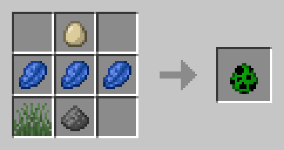

# The Forbidden Recipes Datapack

A data pack for creating spawn eggs and spawners!

## Credits

Created by Jason C. McDonald (CodeMouse92).

Recipe screenshots and some .JSON files created on [https://crafting.thedestruc7i0n.ca/](https://crafting.thedestruc7i0n.ca/)

Dedicated to Scarecrowman and TwistedSlop62.

## Purpose

Implements the truly forbidden recipes, which can absolutely throw off game
balance! Want to craft a spawn egg? A trial spawner? Now you can!

## Recipes

### Spawner

Crafted with a weathered waxed copper grate, a nether star, and a weather waxed copper trapdoor.

### Trial Spawner

Same as the spawner, but with an observer block to the right of the nether star.

### Spawn Eggs

You didn't think we'd make it THAT easy, did you?

Okay, here's the basic idea:

Each spawn egg requires one egg, three lapis lazuli, and two or three items
related to the mob. Consider where it spawns, what it eats, what it drops,
and any other special factors. In at least one case, a different spawn egg
is part of the recipe.

As an example, here's the recipe for the Creeper spawn egg:

Aren't we nice? ^,..,^

We did _not_ include recipes for:

* Ender Dragon (summon it the normal way)
* Iron Golems (build it)
* Wandering Traders (because they don't respect the spawn cap)
* Withers (build it)

Okay, yes, you could technically cheat and look at the mod source code for the
recipes, but where's the fun in that?
